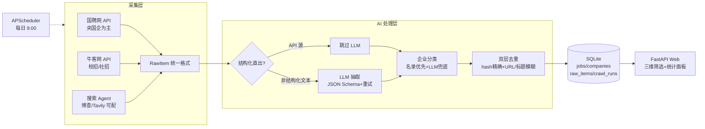

# 🎯 秋招雷达 JobRadar

> **把"每天刷 5 个招聘网站 30 分钟"变成"打开一个页面 3 分钟"。**

## 为什么做这个

每一届秋招学生（尤其是要同时考虑央国企、民企、外企的同学）都在重复同样的事情：

1. **信息分散**：国聘网、牛客、各企业官网、招聘 App——每天要挨个刷一遍，漏一个渠道可能就错过一个批次
2. **央国企窗口短**：央企国企的网申通常只开 1~2 周，信息滞后几天就是直接损失
3. **招聘 App 不按企业性质组织信息**："只看央国企校招"这个高频需求，主流产品都没有对应筛选项

秋招雷达每天 9:00 自动从公开渠道采集岗位，结构化入库，按 **企业性质（央国企/民企/外企）× 招聘类型（校招/社招）× 关键词** 三维筛选，直达投递链接。

**适合谁**：2026/2027 届计算机、AI 方向求职者；也适合想观察各类型企业招聘动向的人。

## 在线体验

- 🤗 Hugging Face Space：`部署后填入链接`（国内访问偶尔较慢）
- 🖥️ 本地运行：见下方[快速开始](#快速开始)，或用 cpolar 内网穿透（见 [DEPLOY.md](DEPLOY.md)）

数据全部来自公开渠道（国聘网、牛客网），仅供求职参考，投递以企业官方页面为准。

## 实测数据（开发期连续采集）

| 指标 | 数值 |
|---|---|
| 岗位入库 | **1021+**（每日 9 点自动递增） |
| 覆盖企业 | 423 家（央国企 389 / 民企 622 / 外企 10 个岗位口径） |
| 去重识别率 | 58.5%（重复条目正确识别并刷新，不重复入库） |
| 单轮全量采集 | ~4 分钟（含限速 1.5s/请求、失败重试） |

## 架构



**核心设计决策**：
- **结构化 API 直出，跳过 LLM**：国聘/牛客都探明了匿名可用的数据接口，字段级准确率 100% 且零 token 成本；LLM 只处理搜索 Agent 命中的非结构化网页
- **名录优先分类**：100 家央企集团 + 90 家外企名录子串匹配（置信度 1.0），未命中走 LLM（0.7），再兜底平台先验（0.3）；高置信度结果不被低置信度覆盖
- **双层去重**：content_hash 唯一索引精确层 + 同企业内 URL 归一化/标题相似度模糊层

## 快速开始

```bash
git clone https://github.com/FanXiaofu/job-radar.git
cd job-radar
pip install -r requirements.txt
cp .env.example .env        # 填入 LLM_API_KEY（可选，推荐 DeepSeek）
python main.py crawl        # 立即采集一轮（约 4 分钟）
python main.py serve        # 启动 Web + 每天 9:00 定时采集
# 浏览器打开 http://127.0.0.1:8000
```

Windows 用户可直接双击 `start.bat`。Docker 用户：`docker compose up -d --build`。

## 配置

| 变量 | 说明 | 默认 |
|---|---|---|
| LLM_API_KEY / LLM_BASE_URL / LLM_MODEL | OpenAI 兼容接口 | DeepSeek |
| SEARCH_PROVIDER / SEARCH_API_KEY | bocha / tavily / none | none |
| SCHEDULE_HOUR / SCHEDULE_MINUTE | 每日采集时刻 | 9:00 |
| PORT / WEB_PORT | 监听端口（容器平台注入 PORT） | 8000 |

## 质量保障

- **独立 AI 评审闭环**：开发中由全新上下文的 AI 评审员按六项 checklist 审查，第一轮发现 6 项 P1 + 17 项 P2 全部修复回归，第二轮复审结论"可交付"——完整报告见 [docs/reviews/](docs/reviews/)
- **单元测试**：`python tests/test_dedup.py`（去重与分类，不依赖网络）
- **抽取评测集**：15 条人工标注样本，`python eval/run_eval.py` 输出字段级准确率
- **运行留痕**：每轮采集的新增/去重/丢弃数落库（`crawl_runs`），原始数据留档可回溯（`raw_items`）

## License

仅供学习与个人求职使用。
